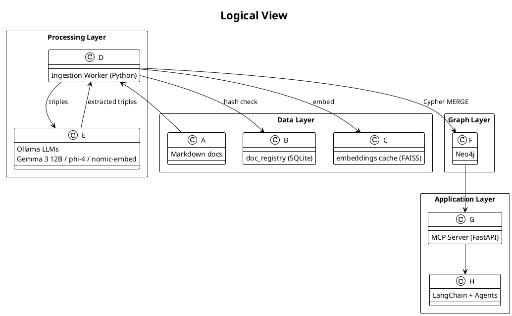

# Skills‑Graph Architecture

A unified reference for importing Bernd’s experience records into a **Hypergraph‑of‑Thought** in Neo4j and exposing it through an **MCP** service that local or cloud‑hosted LLM agents can query.

---

## 1  Scope & Goals

* **Author**  Bernd Prager
* **Revision**  v1.0 · 2025‑05‑15
* **Purpose**  Define components, data flows, schemas, and operational guidelines so that:

  * Markdown records (`jobs`, `extras`, `certifications`) → **hypergraph** (Neo4j)
  * Graph → **MCP server API**
  * LLM/agent stack (Ollama + LangChain) can answer skill‑centric queries.

---

## 2  Logical View

---

## 3  Data Sources

| Folder         | Type               | Example File        | Primary Entities           |
| -------------- | ------------------ | ------------------- | -------------------------- |
| `docs/jobs/`   | Job experience     | `EPAM.md`           | Role, Project, Skill, Tool |
| `docs/extras/` | Extra‑professional | `Ext_WJD.md`        | Activity, Skill            |
| `docs/certs/`  | Certifications     | `certifications.md` | Certification, Skill       |

### Registry Table (`doc_registry`)

| Column          | Type     | Description      |
| --------------- | -------- | ---------------- |
| `doc_id`        | TEXT PK  | stem of filename |
| `hash`          | CHAR(64) | SHA‑256 checksum |
| `last_ingested` | DATETIME | UTC timestamp    |

---

## 4  Ingestion Worker

* **Language** Python 3.11
* **Key libs** langchain‑community, neo4j‑driver, faiss‑cpu, pyyaml, python‑multipart.

### 4.1  Steps per document

1. **Hash check** Skip if unchanged.
2. **Chunk** \~1 500 tokens with overlap = 200.
3. **Embeddings** `nomic-embed-text` → FAISS index (shared).
4. **LLM IE** `gemma3:12b` prompt with known skills/tools.
5. **Dedup** similarity lookup (`>=0.83` FTS OR `>=0.88` embed).
6. **Cypher MERGE** nodes + rels.
7. **Hyperedge build** hash(sorted node‑ids) → create/update.

### 4.2  Config File

Store schema & prompt hints in **`graph_schema.yaml`** (see separate file).

---

## 5  Graph Schema (Neo4j)

Refer to `graph_schema.yaml` for machine‑readable detail.

* **Core labels** `Person, Role, Organization, Project, Activity, Certification, Skill, Tool, Topic, Hyperedge`.
* **Key rels** `HAS_ROLE, WORKED_AT, CONTRIBUTED_TO, USED_IN, SHOWCASED_IN, COVERS_TOPIC, OWNS_CERT, SUPPORTS_SKILL, CONNECTS`.
* **Indexes**

  * `CREATE CONSTRAINT person_name IF NOT EXISTS ON (p:Person) ASSERT p.name IS UNIQUE;`
  * `CREATE FULLTEXT INDEX skill_name IF NOT EXISTS FOR (s:Skill) ON EACH [s.name];`

---

## 6  Infrastructure Topology

| Host                              | Stack                                      | Ports     |
| --------------------------------- | ------------------------------------------ | --------- |
| **odin** (Ubuntu 22 LTS, Ryzen 9) | Neo4j 5.15 (Docker)                        | 7474/7687 |
| idem                              | Ollama 0.1.x (models in `/var/lib/ollama`) | 11434     |
| idem                              | Ingestion Worker (systemd unit)            | –         |
| idem                              | FastAPI MCP server                         | 8000      |

> **Note** RTX 2060 (6 GB VRAM) runs `gemma3:12b` Q4\_0; bigger models spill to RAM.

---

## 7  MCP Server

* **Framework** FastAPI + LangChain Graph
* **Auth** Bearer JWT (future: OIDC)
* **Endpoints**

  * `POST /query` → JSON {prompt, agent="graph-rag"}
  * `POST /skill_matrix` → returns CSV of skills vs. evidence nodes
* **Agent Types**

  * **GraphRAGAgent** → augments prompt with Cypher results
  * **SkillLensAgent** → tailored skill queries (`MATCH (s:Skill)<-[:SHOWCASED_IN]-(n) …`)

---

## 8  Observability

* **Neo4j** → Prometheus exporter (`/metrics`)
* **Worker** → structured logs (JSON) + Loki
* **FastAPI** → OpenTelemetry traces

---

## 9  Maintenance

| Job                  | Schedule     | Tool                       |
| -------------------- | ------------ | -------------------------- |
| `nightly_dedupe`     | 03:00        | APOC `refactor.mergeNodes` |
| `refresh_embeddings` | After dedupe | Custom Python              |
| `recompute_metrics`  | Weekly       | Neo4j Algo (betweenness)   |

---

## 10  Security & Backup

* **Backups** Neo4j `neo4j-admin backup` daily → `/backups/neo4j/` (btrfs snapshot).
* **Access** Neo4j roles: `reader` for MCP; `admin` for ingestion.
* **Secrets** Env files managed via `systemd EnvironmentFile=`.

---

## 11  Future Enhancements

1. Swap FAISS for **Chroma** to avoid RAM overhead.
2. Experiment with **phi4‑reasoning** as hyperedge‑suggestion co‑pilot.
3. Deploy MCP in **K8s (k3s)** for HA.

---

**© 2025 Bernd Prager** –  Licensed under Apache 2.0

