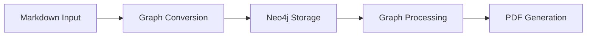

# System Patterns

## Architecture Overview

### Core Components
1. **Hypergraph Model**
   - Neo4j database for graph storage
   - Node2Vec embeddings for semantic understanding
   - Graph-of-Thought processing

2. **Data Processing Pipeline**
   - Markdown → Graph conversion
   - Gleaning loop for fact extraction
   - Graph → Markdown → PDF pipeline

3. **Local AI Processing**
   - Ollama integration
   - Local LLM operations
   - No external API dependencies

## Design Patterns

### Data Flow

### Component Relationships
- FastAPI for API endpoints
- Neo4j for graph storage
- Node2Vec for embeddings
- Ollama for local AI processing

## Technical Decisions

### Database
- Neo4j chosen for graph capabilities
- Hypergraph model for complex relationships
- Efficient querying for résumé generation

### AI Processing
- Local Ollama deployment
- Graph-of-Thought model
- Node2Vec for semantic understanding

### API Design
- RESTful endpoints
- Async processing
- Type-safe interfaces

## Testing Strategy
- 100% unit test coverage
- Integration tests for core flows
- Performance benchmarks
- Privacy compliance checks 