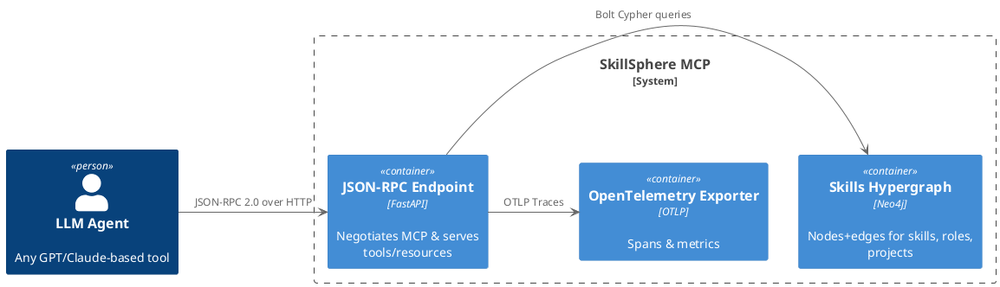
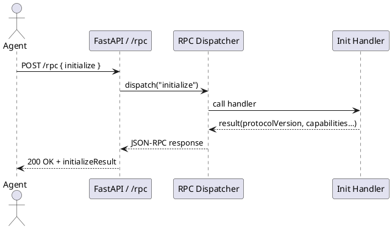

<!-- markdownlint-disable MD024 -->
# SkillSphere MCP Server Architecture

## Overview

The SkillSphere MCP Server is a FastAPI-based application that provides a JSON-RPC 2.0 compliant interface for interacting with the SkillSphere graph database. It supports semantic search, graph queries, and tool dispatching.

## Application Structure

### Core Components

1. **API Layer**
   - FastAPI application with JSON-RPC 2.0 support
   - MCP-compliant endpoints
   - Authentication middleware
   - Request/response validation

2. **Graph Database**
   - Neo4j connection management
   - Read-only access enforcement
   - Vector similarity search
   - Graph query execution

3. **Semantic Search**
   - Sentence Transformers integration
   - Vector embeddings
   - Similarity scoring
   - Result ranking

4. **Graph Embeddings**
   - Node2Vec implementation
   - Random walk generation
   - Alias sampling
   - Embedding training
   - Vector similarity search

5. **Tool Dispatcher**
   - Method registration
   - Parameter validation
   - Error handling
   - Response formatting

### Cross-Cutting Concerns

1. **Security**
   - PAT authentication
   - Read-only Neo4j access
   - Input validation
   - Error message sanitization

2. **Observability**
   - OpenTelemetry integration
   - Request tracing
   - Performance monitoring
   - Error tracking

3. **Performance**
   - Connection pooling
   - Async operations
   - Vector optimization
   - Caching (planned)

## Module Decomposition

| Module | Responsibility |
|--------|----------------|
| `api.jsonrpc` | JSON-RPC 2.0 request/response handling |
| `api.mcp_routes` | MCP-compliant endpoint definitions |
| `auth.pat` | PAT token validation |
| `db.connection` | Neo4j connection management |
| `models.embedding` | Vector embedding generation |
| `models.graph` | Graph data models |
| `graph.node2vec.config` | Node2Vec configuration classes |
| `graph.node2vec.state` | State management for embeddings |
| `graph.node2vec.sampling` | Alias sampling methods |
| `graph.node2vec.walks` | Random walk generation |
| `graph.node2vec.training` | Training and embedding methods |
| `graph.node2vec.model` | Main Node2Vec implementation |
| `tools.dispatcher` | Tool method dispatching |
| `app.py` | FastAPI application setup and configuration |

## Future Improvements

1. **Search Enhancements**
   - Redis-based caching
   - Hybrid search support
   - Filtering by node type
   - Result pagination

2. **Graph Features**
   - Relationship traversal
   - Path finding
   - Graph analytics
   - Schema validation
   - Embedding optimization
   - Parallel walk generation
   - Custom sampling strategies
   - Embedding persistence

3. **Performance**
   - Connection pooling
   - Query optimization
   - Caching strategy
   - Rate limiting

4. **Developer Experience**
   - API documentation
   - Example clients
   - Development tools
   - Testing utilities

## API Endpoints

### JSON-RPC 2.0 Endpoint

- **POST /mcp/rpc**
  - Handles all JSON-RPC 2.0 requests
  - Publicly accessible
  - Supports method registration via decorator
  - Validates request format
  - Returns standardized responses
  - Methods:
    - `initialize` - Protocol handshake
    - `resources/list` - List available resources
    - `resources/get` - Get resource schema
    - `search` - Semantic search
    - `tool` - Dispatch tool calls

### MCP Resources

- **GET /mcp/resources/list**
  - Lists available resources
  - Returns resource metadata
  - Publicly accessible

- **GET /mcp/resources/get/{resource}**
  - Returns resource schema
  - Validates resource existence
  - Publicly accessible

### Search

- **POST /mcp/search**
  - Performs semantic search
  - Returns ranked results
  - Supports pagination
  - Publicly accessible

### Tools

- **POST /mcp/tool**
  - Dispatches tool calls
  - Validates parameters
  - Returns tool results
  - Publicly accessible

## Dependencies

- FastAPI (Web framework)
- Neo4j (Graph database)
- Sentence Transformers (Semantic search)
- OpenTelemetry (Observability)
- Pydantic (Data validation)
- NumPy (Vector operations)
- scikit-learn (Similarity metrics)
- gensim (Node2Vec implementation)
- scipy (Scientific computing)
- node2vec (Graph embeddings)
- Redis (planned, for caching)

## Development Guidelines

1. Follow PEP 8 style guide
2. Maintain 90% test coverage
3. Use type hints consistently
4. Document all public APIs
5. Keep dependencies up to date
6. Write contract tests for schema changes

## Deployment

- Docker-based deployment (planned)
- Kubernetes support (planned)
- Environment-based configuration
- Health check integration
- Monitoring setup
- Rate limiting (planned)

## Application Lifecycle

The application follows a clear lifecycle managed by FastAPI's lifespan events:

1. **Startup**
   - Load environment variables
   - Configure logging
   - Initialize OpenTelemetry
   - Create FastAPI application
   - Register routes and middleware

2. **Runtime**
   - Handle JSON-RPC requests
   - Manage database connections
   - Process tool dispatches
   - Track metrics and traces

3. **Shutdown**
   - Close database connections
   - Flush telemetry data
   - Clean up resources

## Entry Points

The application can be started in two ways:

1. **Python Module**

   ```bash
   python -m skill_sphere_mcp.app
   ```

2. **CLI Script**

   ```bash
   mcp-server
   ```

Both methods use the same application factory pattern in `app.py` to ensure consistent initialization.

© 2025 Bernd Prager – MIT License

# SkillSphere MCP – Architecture Document

## Version 0.2 · May 2025

---

## 1 · Purpose

This document describes the architecture of the **SkillSphere MCP Server**—a Model Context Protocol (MCP) implementation that exposes Bernd Prager's skills-and-experience hypergraph to LLM agents. It supplements the Product-Design Document (PDD) and is intended for contributors and DevOps engineers.

---

## 2 · Context & Stakeholders

| Stakeholder              | Concern                                                       |
| ------------------------ | ------------------------------------------------------------- |
| **LLM recruiter agents** | Query suitability, evidence, skills gaps.                     |
| **CV generator agents**  | Produce tailored résumé/cover letter output.                  |
| **Bernd Prager**         | Single source of truth for career data; easy to extend.       |
| **DevOps**               | Containerised deployment, observability, reproducible builds. |

---

## 3 · Views

### 3.1 Logical View



### 3.2 Process View – *initialize* Sequence



### 3.3 Deployment View

```{ .plantuml height=50% plantuml-filename=DeploymentView.png }
@startuml
skinparam componentStyle rectangle
skinparam shadowing false

node "Docker Host" {
  node "otel-collector" <<Collector>> {
  }

  node "mcp-server" <<Python/FastAPI>> {
    component "uvicorn\nFastAPI app" as api
  }

  database "Neo4j\nSkills Graph" <<Neo4j>> {
  }
}

api --> "Neo4j\nSkills Graph" : Bolt queries
api --> "otel-collector" : OTLP traces
@enduml
```

---

## 4 · Module Decomposition

| Module               | Path                    | Responsibility                            |
| -------------------- | ----------------------- | ----------------------------------------- |
| **`main.py`**        | `src/skill_sphere_mcp/` | Uvicorn entrypoint, mounts routers.       |
| **`config.py`**      |  " "                   | Pydantic settings (env vars).             |
| **`models/`**        |  " "                   | Pydantic schemas (RPC, resources, tools). |
| **`services/`**      |  " "                   | Business logic & Neo4j access.            |
| **`handlers/`**      |  " "                   | MCP method implementations.               |
| **`routers/rpc.py`** |  " "                   | `/rpc` JSON-RPC endpoint.                 |
| **`telemetry/`**     |  " "                   | OpenTelemetry setup & middleware.         |

---

## 5 · Key Scenarios

1. **Suitability check** – `skill.match_role`

   1. Agent posts `tools/call` → dispatcher
   2. `SkillService.match_role()` implements a sophisticated matching algorithm:
      - **Semantic Similarity**: Uses Node2Vec embeddings to find semantically similar skills
      - **Experience Matching**: Considers years of experience with weighted scoring
      - **Evidence Collection**: Gathers supporting evidence from related nodes
      - **Gap Analysis**: Identifies missing skills and experience gaps
   3. Scoring components:
      - 60% skill match (exact or semantic)
      - 40% experience match
      - Threshold of 0.7 for considering a match
   4. Returns comprehensive response:
      - Overall match score
      - Matching skills with evidence
      - Skill gaps
      - Supporting nodes for verification

2. **Targeted CV generation** – `cv.generate`

   1. Handler invokes `CVService.generate()` → Jinja2 template → Markdown (or PDF via `weasyprint`).

---

## 6 · Cross-Cutting Concerns

| Concern           | Approach                                                                |
| ----------------- | ----------------------------------------------------------------------- |
| **Observability** | Automatic FastAPI and Requests instrumentation, OTLP exporter.          |
| **Security**      | Read-only Hypergraph in Neo4j; future OAuth2 for write APIs.            |
| **Testing**       | Pytest fixtures spin up Neo4j Testcontainer; 90 % unit coverage target. |
| **CI/CD**         | GitHub Actions → `docker buildx bake` → ghcr.io release.                |

---

## 7 · Environment & Config

See `.env.example` for bind address, Neo4j URI, OTLP endpoint, protocol metadata.

---

## 8 · Future Work

- Switch from Node2Vec to Graph RAG embeddings.
- Add streaming subscriptions (`resources.subscribe`).
- Expose interview simulation tool.

---

© 2025 Bernd Prager – MIT License
