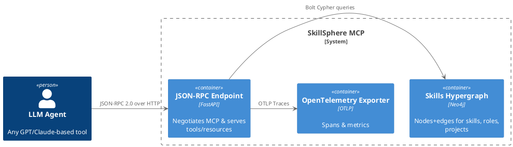
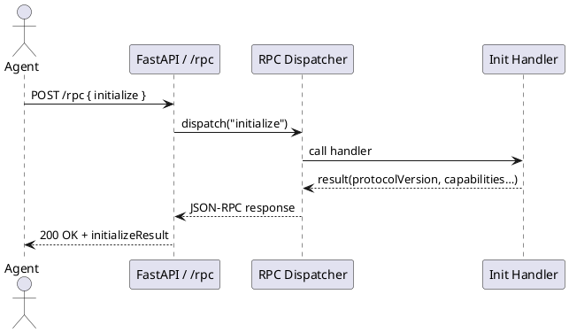

# SkillSphere MCP – Architecture Document

*Version 0.2 · May 2025*

---

## 1 · Purpose

This document describes the architecture of the **SkillSphere MCP Server**—a Model Context Protocol (MCP) implementation that exposes Bernd Prager’s skills‑and‑experience hypergraph to LLM agents. It supplements the Product‑Design Document (PDD) and is intended for contributors and DevOps engineers.

---

## 2 · Context & Stakeholders

| Stakeholder              | Concern                                                       |
| ------------------------ | ------------------------------------------------------------- |
| **LLM recruiter agents** | Query suitability, evidence, skills gaps.                     |
| **CV generator agents**  | Produce tailored résumé/cover letter output.                  |
| **Bernd Prager**         | Single source of truth for career data; easy to extend.       |
| **DevOps**               | Containerised deployment, observability, reproducible builds. |

---

## 3 · Views

### 3.1 Logical View



### 3.2 Process View – *initialize* Sequence



### 3.3 Deployment View

```{ .plantuml height=50% plantuml-filename=DeploymentView.png }
@startuml
skinparam componentStyle rectangle
skinparam shadowing false

node "Docker Host" {
  node "otel-collector" <<Collector>> {
  }

  node "mcp-server" <<Python/FastAPI>> {
    component "uvicorn\nFastAPI app" as api
  }

  database "Neo4j\nSkills Graph" <<Neo4j>> {
  }
}

api --> "Neo4j\nSkills Graph" : Bolt queries
api --> "otel-collector" : OTLP traces
@enduml
```

---

## 4 · Module Decomposition

| Module               | Path                    | Responsibility                            |
| -------------------- | ----------------------- | ----------------------------------------- |
| **`main.py`**        | `src/skill_sphere_mcp/` | Uvicorn entrypoint, mounts routers.       |
| **`config.py`**      |  “  ”                   | Pydantic settings (env vars).             |
| **`models/`**        |  “  ”                   | Pydantic schemas (RPC, resources, tools). |
| **`services/`**      |  “  ”                   | Business logic & Neo4j access.            |
| **`handlers/`**      |  “  ”                   | MCP method implementations.               |
| **`routers/rpc.py`** |  “  ”                   | `/rpc` JSON‑RPC endpoint.                 |
| **`telemetry/`**     |  “  ”                   | OpenTelemetry setup & middleware.         |

---

## 5 · Key Scenarios

1. **Suitability check** – `skill.match_role`

   1. Agent posts `tools/call` → dispatcher
   2. `SkillService.match_role()` loads Node2Vec embeddings from Neo4j, computes cosine similarity, returns score & gap list.
   3. Handler serialises result for JSON‑RPC.
2. **Targeted CV generation** – `cv.generate`

   1. Handler invokes `CVService.generate()` → Jinja2 template → Markdown (or PDF via `weasyprint`).

---

## 6 · Cross‑Cutting Concerns

| Concern           | Approach                                                                |
| ----------------- | ----------------------------------------------------------------------- |
| **Observability** | Automatic FastAPI and Requests instrumentation, OTLP exporter.          |
| **Security**      | Read‑only Hypergraph in Neo4j; future OAuth2 for write APIs.            |
| **Testing**       | Pytest fixtures spin up Neo4j Testcontainer; 90 % unit coverage target. |
| **CI/CD**         | GitHub Actions → `docker buildx bake` → ghcr.io release.                |

---

## 7 · Environment & Config

See `.env.example` for bind address, Neo4j URI, OTLP endpoint, protocol metadata.

---

## 8 · Future Work

* Switch from Node2Vec to Graph Transformer embeddings.
* Add streaming subscriptions (`resources.subscribe`).
* Expose interview simulation tool.

---

© 2025 Bernd Prager – MIT License

