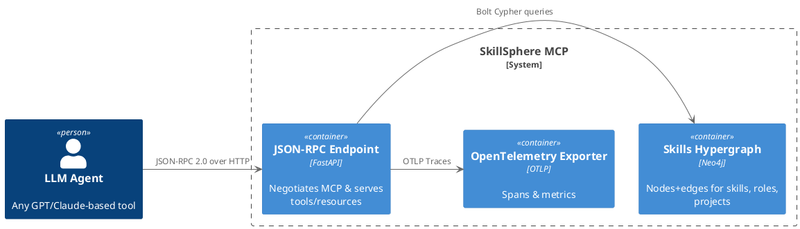
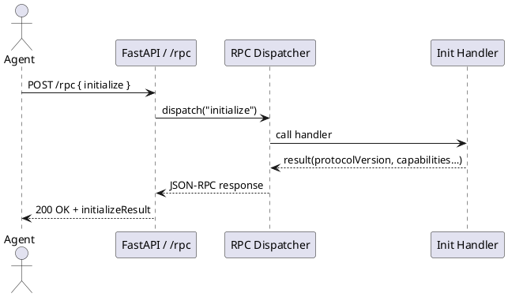

<!-- markdownlint-disable MD024 -->
# SkillSphere MCP Server Architecture

## Overview

The SkillSphere MCP Server exposes Bernd Prager's skills-and-experience hypergraph through the Model Context Protocol (MCP) for LLM agents to reason over. The system combines graph-based knowledge representation with semantic search capabilities to provide intelligent skill matching and CV generation.

## Core Components

### 1. Application Structure

The application is organized into three main files:

- `main.py`: Application entry point and lifecycle management
  - Handles startup/shutdown events
  - Configures OpenTelemetry
  - Verifies Neo4j connectivity
  - Mounts API routes

- `mcp_server.py`: Core application configuration
  - Settings management
  - OpenTelemetry setup
  - Neo4j driver configuration
  - FastAPI application instance

- `routes.py`: API route handlers
  - Health check endpoint
  - Entity retrieval
  - Semantic search functionality
  - Request/response models

### 2. API Layer

- FastAPI-based REST API with OpenTelemetry instrumentation
- PAT-based authentication with token validation
- MCP protocol compliance (v1.0)
- Health check and monitoring endpoints
- CORS middleware for cross-origin requests

### 3. Graph Database

- Neo4j backend for skills hypergraph
- Async connection management with proper session cleanup
- Read-only access for security
- Bolt protocol for efficient communication
- Connection pooling for performance

### 4. Semantic Search

- Sentence Transformer-based query encoding (all-MiniLM-L6-v2 model)
- Cosine similarity search for semantic matching
- Node2Vec embeddings for graph nodes
- OpenTelemetry tracing for performance monitoring
- Graceful fallback for missing dependencies
- Efficient vector operations using numpy

### 5. Tool Dispatcher

- JSON Schema validation for all tool calls
- Core tools:
  - `skill.match_role`: Role suitability assessment
  - `skill.explain_match`: Evidence-based matching explanation
  - `cv.generate`: Targeted CV generation
  - `graph.search`: Semantic graph search

## Cross-Cutting Concerns

### Security

- PAT authentication with token expiration
- Read-only Neo4j access
- No PII exposure
- Input validation and sanitization
- Rate limiting (planned)

### Observability

- OpenTelemetry integration with OTLP exporter
- Structured logging with correlation IDs
- Performance metrics and tracing
- Error tracking and alerting
- Request/response monitoring

### Performance

- Async I/O for concurrent operations
- Connection pooling for Neo4j
- Embedding caching (planned)
- Efficient vector operations
- Query optimization

## Future Improvements

### 1. Search Enhancements

- [ ] Add Redis-based caching for frequently used embeddings
- [ ] Implement filtering by node type and properties
- [ ] Add comprehensive tests for semantic search functionality
- [ ] Support hybrid search (semantic + keyword)
- [ ] Add relevance feedback mechanism

### 2. Graph Features

- [ ] Replace Node2Vec with Graph-RAG embeddings
- [ ] Add write-back for interview feedback
- [ ] Support multi-tenant mode
- [ ] Implement graph versioning
- [ ] Add relationship strength analysis

### 3. Performance & Scalability

- [ ] Add Redis caching layer for hot data
- [ ] Implement connection pooling with health checks
- [ ] Add load balancing support
- [ ] Implement request queuing
- [ ] Add performance benchmarks

### 4. Developer Experience

- [ ] Add comprehensive API documentation
- [ ] Implement development containers
- [ ] Add integration tests
- [ ] Improve error messages
- [ ] Add performance profiling tools

## Dependencies

- FastAPI (Web framework)
- Neo4j (Graph database)
- Sentence Transformers (Semantic search)
- OpenTelemetry (Observability)
- Pydantic (Data validation)
- NumPy (Vector operations)
- scikit-learn (Similarity metrics)

## Development Guidelines

1. Follow PEP 8 style guide
2. Maintain 90% test coverage
3. Use type hints consistently
4. Document all public APIs
5. Keep dependencies up to date

## Deployment

- Docker-based deployment
- Kubernetes support
- Environment-based configuration
- Health check integration
- Monitoring setup

© 2025 Bernd Prager – MIT License

# SkillSphere MCP – Architecture Document

## Version 0.2 · May 2025

---

## 1 · Purpose

This document describes the architecture of the **SkillSphere MCP Server**—a Model Context Protocol (MCP) implementation that exposes Bernd Prager's skills-and-experience hypergraph to LLM agents. It supplements the Product-Design Document (PDD) and is intended for contributors and DevOps engineers.

---

## 2 · Context & Stakeholders

| Stakeholder              | Concern                                                       |
| ------------------------ | ------------------------------------------------------------- |
| **LLM recruiter agents** | Query suitability, evidence, skills gaps.                     |
| **CV generator agents**  | Produce tailored résumé/cover letter output.                  |
| **Bernd Prager**         | Single source of truth for career data; easy to extend.       |
| **DevOps**               | Containerised deployment, observability, reproducible builds. |

---

## 3 · Views

### 3.1 Logical View



### 3.2 Process View – *initialize* Sequence



### 3.3 Deployment View

```{ .plantuml height=50% plantuml-filename=DeploymentView.png }
@startuml
skinparam componentStyle rectangle
skinparam shadowing false

node "Docker Host" {
  node "otel-collector" <<Collector>> {
  }

  node "mcp-server" <<Python/FastAPI>> {
    component "uvicorn\nFastAPI app" as api
  }

  database "Neo4j\nSkills Graph" <<Neo4j>> {
  }
}

api --> "Neo4j\nSkills Graph" : Bolt queries
api --> "otel-collector" : OTLP traces
@enduml
```

---

## 4 · Module Decomposition

| Module               | Path                    | Responsibility                            |
| -------------------- | ----------------------- | ----------------------------------------- |
| **`main.py`**        | `src/skill_sphere_mcp/` | Uvicorn entrypoint, mounts routers.       |
| **`config.py`**      |  " "                   | Pydantic settings (env vars).             |
| **`models/`**        |  " "                   | Pydantic schemas (RPC, resources, tools). |
| **`services/`**      |  " "                   | Business logic & Neo4j access.            |
| **`handlers/`**      |  " "                   | MCP method implementations.               |
| **`routers/rpc.py`** |  " "                   | `/rpc` JSON-RPC endpoint.                 |
| **`telemetry/`**     |  " "                   | OpenTelemetry setup & middleware.         |

---

## 5 · Key Scenarios

1. **Suitability check** – `skill.match_role`

   1. Agent posts `tools/call` → dispatcher
   2. `SkillService.match_role()` loads Node2Vec embeddings from Neo4j, computes cosine similarity, returns score & gap list.
   3. Handler serialises result for JSON-RPC.
2. **Targeted CV generation** – `cv.generate`

   1. Handler invokes `CVService.generate()` → Jinja2 template → Markdown (or PDF via `weasyprint`).

---

## 6 · Cross-Cutting Concerns

| Concern           | Approach                                                                |
| ----------------- | ----------------------------------------------------------------------- |
| **Observability** | Automatic FastAPI and Requests instrumentation, OTLP exporter.          |
| **Security**      | Read-only Hypergraph in Neo4j; future OAuth2 for write APIs.            |
| **Testing**       | Pytest fixtures spin up Neo4j Testcontainer; 90 % unit coverage target. |
| **CI/CD**         | GitHub Actions → `docker buildx bake` → ghcr.io release.                |

---

## 7 · Environment & Config

See `.env.example` for bind address, Neo4j URI, OTLP endpoint, protocol metadata.

---

## 8 · Future Work

- Switch from Node2Vec to Graph RAG embeddings.
- Add streaming subscriptions (`resources.subscribe`).
- Expose interview simulation tool.

---

© 2025 Bernd Prager – MIT License
